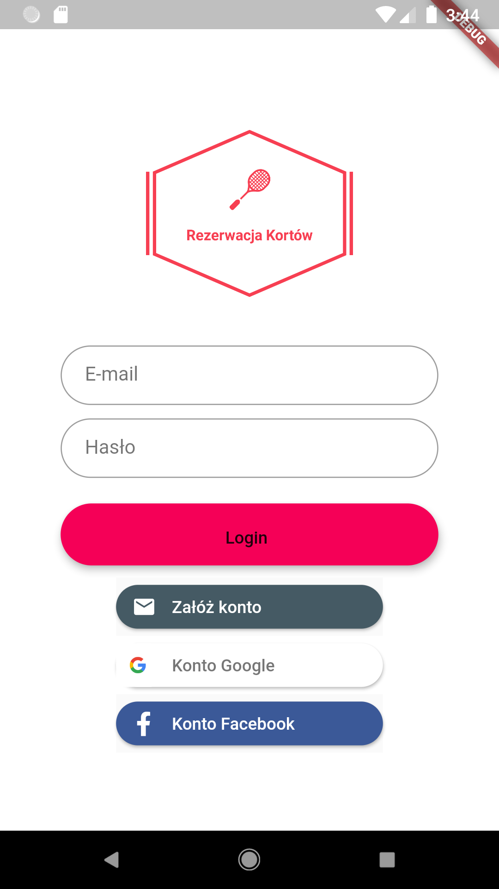
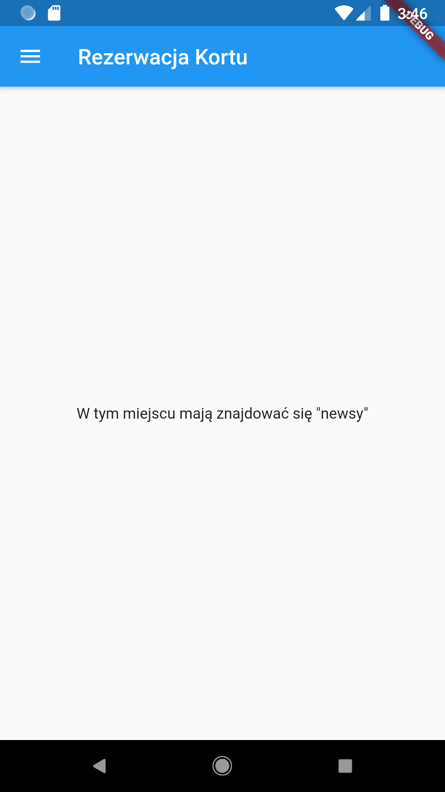
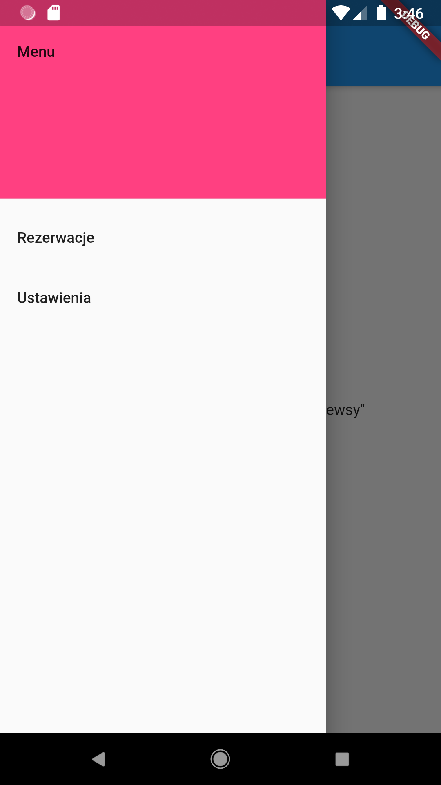
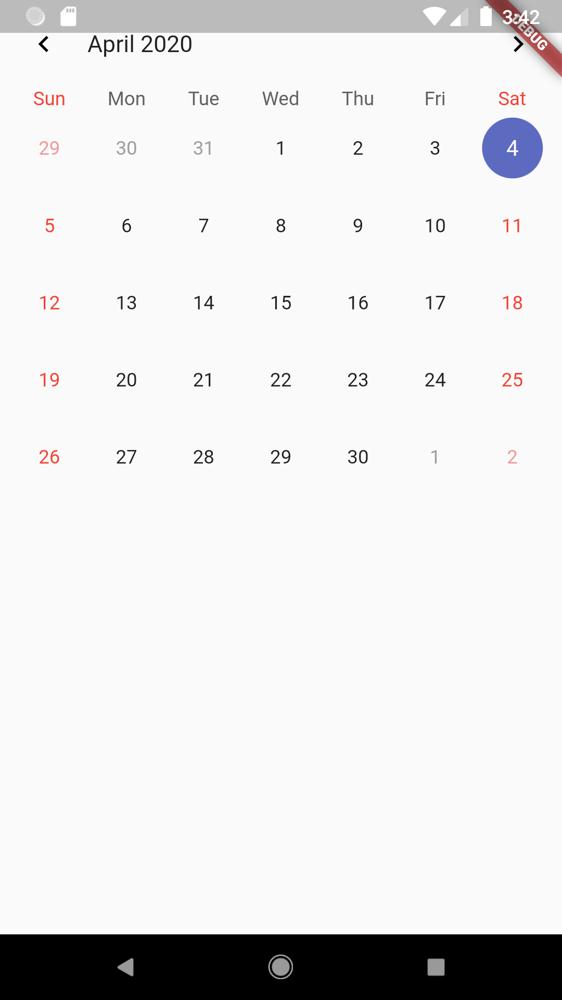
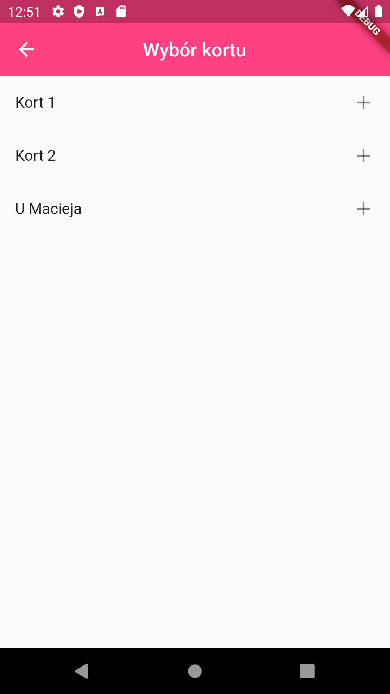
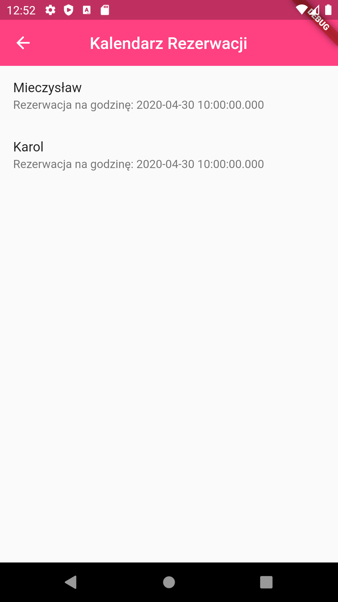

# Projekt-Aplikacji-Mobilnej-1
System rezerwacji kortów

## Table of contents
* [General info](#general-info)
* [Podstawowe Funkcje](#podstawowe-funkcje)
* [Dodatkowe Funkcje](#dodatkowe-funkcje)
* [Technologie](#technologie)
* [Raport1](#raport-1)
* [Raport2](#raport-2)
* [Raport3](#raport-3)
* [Prototyp](#prototyp)

## General Info
* Projekt zakłada stworzenie aplikacji na system Android umożliwiającej rezerwacje kortu tenisowego.

## Podstawowe Funkcje
* rejestracja i logowanie uzytkownikow
* pokazywanie dostepnej liczby kortów oraz jakie godziny są zajęte (coś na wzór interaktywnego kalendarza)
* karta z informacjami o korcie (lokalizajca godziny otwarcia)

## Dodatkowe Funkcje
* Karta z "newsami" np. informacje o turniejach, specjlanch wydarzeniach itp.
* Podstawowy system płatności

## Technologie
* Flutter
* Język programowania: Dart
* Firebase
* Android Studio
	
## Raport 1
* Zrobiłem podstawowe layouty poszczególnych ekranów
* Ekran logowania, poczatkowo chcialbym aby jedyną opcją logowania była opcja z mailem
* głowny ekran widoczny po zalogowaniu, z lewej strony wysuwane menu widoczne na nastepnym screenie
* karta rezerwacji czyli główna fukncjonalość będzie w postaci zwykłego kalendarza, po kliknięciu w dany dzień będziemy mieli kolejny ekran wyboru numeru kortu, a nastepnie kartę z rozpiską godzina po godzinie.

## Raport 2
* Dodane ścieżki do poszczególnych ekranów dzięki czemu mozna już się płynnie poruszać po aplikacji
* dodanie integracji z Firebasem
* dodany prosty system rejstracji za pomocą emaila(bez potwierdzenia)
* dodany system logowania

## Raport 3
* integracja z bazą danych NoSQL - Firestore
* dodanie możliwości wyboru kortu(Korty są wczytywane z bazy danych)
* dla każdego kortu jest kalendarz z wyborem dnia, po wybraniu danego dnia aplikacja pokazuje nam rezerwacje dla danego dnia
* Aktualnie chciałbym dopracować kartę rezerwacji dla danego dnia, a także umozliwić użytkownikowi dodanie własnej rzerwacji z poziomu aplikacji

## Prototyp
* Dopracowanie karty rezerwacji
* Użytkownicy mogą dodawać już własne rezerwacje i je usuwać więc można powiedzieć że aplikacja spełnia już swoje podstawowe zadanie ale...
* .. niestety jest kilka brakujących elementow jak np. zablokowanie możliwości rezerwowanie wstecz, kilka aspektów wizualnuych jak formatowanie wyświetlanej daty.
* brakuje także karty z informacją o danym korcie jednak na pewno będzie to zrobione

